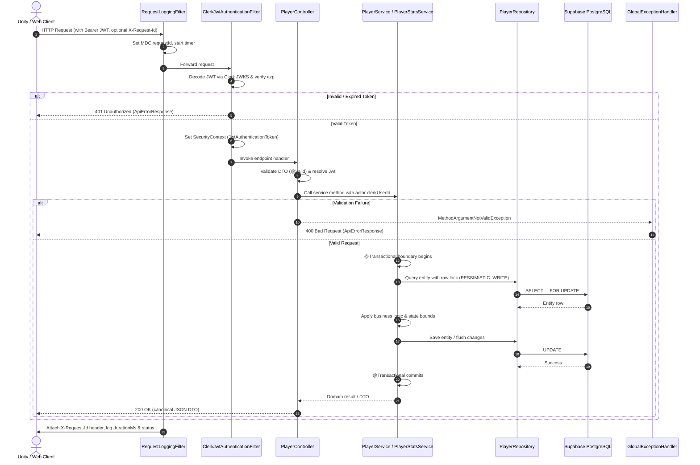

# Spring Boot Backend Conventions

Act as a principal backend engineer and mentor. Apply these conventions when designing, implementing, reviewing, debugging, testing, or extending the UIU Simulator Spring Boot backend. Explain concepts with architectural clarity and precise terminology.

**Primary Source of Truth:** The existing Spring Boot codebase (`backend/`) is the primary source of truth. Always inspect existing controllers, services, entities, repositories, DTOs, security configurations, and Flyway migration scripts before making changes. Match local naming and patterns; do not assume external defaults override established conventions unless resolving a concrete bug, security vulnerability, or architectural risk.

**Technology Stack:**
- **Framework:** Spring Boot 3.4.x (Java 17)
- **Database:** Supabase-hosted PostgreSQL (managed via Flyway migrations)
- **Authentication:** Clerk JWT verification (Spring Security OAuth2 Resource Server / NimbusJwtDecoder)
- **Persistence:** Spring Data JPA / Hibernate 6 (`open-in-view: false`, `ddl-auto: validate`)
- **Validation:** Jakarta Bean Validation (`jakarta.validation.*`)
- **Logging:** SLF4J with MDC (`requestId`, `X-Request-Id` filter)
- **Client Consumers:** Unity Game Client (WebGL / Desktop Editor), Web / Admin frontends

---

## 1. Purpose

- Design, implement, review, and debug backend features using a clean, layered Spring Boot architecture.
- Enforce strict layer boundaries: thin controllers, rich domain/service business logic, isolated JPA repositories, and explicit DTO contracts.
- Guarantee database safety, transactional consistency, and concurrency control across all state-mutating operations.
- Ensure seamless, secure integration with Clerk authentication and Supabase-hosted PostgreSQL.
- Maintain a single, predictable, client-friendly global error contract.

---

## 2. Architecture & Layer Boundaries

### Layer Responsibilities

| Layer | Primary Responsibility | Annotations / Components | Must Do | Must NOT Do |
|---|---|---|---|---|
| **Web / Controller** | HTTP adapter & protocol boundary | `@RestController`, `@RequestMapping`, `@GetMapping`, `@PostMapping`, `@PatchMapping`, `@PutMapping` | Extract validated DTOs (`@Valid @RequestBody`), resolve authenticated user (`@AuthenticationPrincipal Jwt`), delegate to services, return `ResponseEntity<DTO>` | No business logic, no repository calls, no JPA query execution, no transaction management, no `try/catch` for normal control flow |
| **Service** | Domain rules, orchestration, transaction & concurrency boundary | `@Service`, `@Transactional` | Enforce domain invariants, verify resource ownership, orchestrate repositories, evaluate lost-update concurrency, demarcate transactions, throw typed domain exceptions | No raw HTTP objects (`HttpServletRequest`, `HttpServletResponse`), no SQL strings, no response status code handling |
| **Repository** | Data access & query abstraction | `@Repository`, `JpaRepository<Entity, ID>` | Standard Spring Data queries, parameterized JPQL / native queries, locking queries (`@Lock`), return `Optional<Entity>` for single lookups | No HTTP concerns, no cross-entity business rules, no transaction ownership unless narrowly justified |
| **Entity** | Relational mapping & domain state | `@Entity`, `@Table`, `@Id`, `@Column` | Map database columns to fields in `snake_case`, encapsulate state transitions, provide defensive constructor/factory methods | Do NOT expose entities directly in HTTP responses; avoid unbounded lazy relationships; no business-layer HTTP awareness |
| **DTO** | API contract & serialization boundary | Java `record` (preferred) or immutable class | Declare explicit serialization fields, annotate with Jakarta validation constraints (`@NotNull`, `@Min`, etc.) | Do not couple directly to JPA persistence annotations; do not leak internal database implementation details |
| **Security / Auth** | Request authentication & principal extraction | `OncePerRequestFilter`, `SecurityFilterChain`, `JwtDecoder` | Validate Bearer tokens against Clerk JWKS, verify authorized parties (`azp`), populate `SecurityContext` with `JwtAuthenticationToken` | Never trust client-supplied user IDs; do not perform manual JWT decoding inside controllers or services |
| **Common / Advice** | Cross-cutting error handling & observability | `@RestControllerAdvice`, `@ExceptionHandler`, `Filter` | Translate unhandled exceptions into uniform `ApiErrorResponse`, manage MDC correlation IDs (`X-Request-Id`) | Do not maintain competing error response models; never expose stack traces, SQL, database credentials, or secret keys |

### Package Structure

The backend follows a domain-feature package structure:

```
backend/src/main/java/com/uiusimulator/
├── UiuSimulatorApplication.java
├── auth/                         # Clerk auth, dev bridge & token verification
│   ├── controller/               # AuthController, AuthPageController, DevAuthBridgeController
│   ├── dto/                      # AuthLoginResponse, DevBridge DTOs
│   ├── exception/                # AuthenticationFailedException
│   ├── security/                 # ClerkJwtAuthenticationFilter
│   └── service/                  # AuthService, DevAuthBridgeService
├── common/                       # Shared cross-cutting concerns
│   ├── exception/                # GlobalExceptionHandler
│   ├── logging/                  # RequestLoggingFilter (X-Request-Id, MDC)
│   └── response/                 # ApiErrorResponse
├── config/                       # Spring & security infrastructure config
│   ├── ClerkProperties.java      # @ConfigurationProperties(prefix = "uiu.clerk")
│   ├── CorsConfig.java           # Cross-origin policies
│   └── SecurityConfig.java       # SecurityFilterChain & JwtDecoder bean definitions
└── player/                       # Player identity & progression domain
    ├── controller/               # PlayerController (/api/players/me)
    ├── dto/                      # PlayerResponse, PlayerStatsResponse, PlayerStatsDeltaRequest
    ├── entity/                   # Player entity
    ├── repository/               # PlayerRepository
    └── service/                  # PlayerService, PlayerStatsService
```

---

## 3. Standard Request Flow



---

## 4. API Design & Canonical Routing Conventions

1. **Canonical Routes Over Aliases:** Prefer one canonical REST route and avoid unnecessary duplicate route surfaces.
   - The canonical player route in this project is `/api/players/me`.
   - **Do NOT** add singular `/api/player/...` aliases merely because conceptual architecture discussions used singular nouns. Only introduce compatibility aliases when an existing, deployed client strictly requires them.
2. **RESTful Semantics:**
   - `GET /api/players/me`: Read authenticated player profile and canonical stats.
   - `PATCH /api/players/me/stats`: Apply a validated delta mutation to persistent player stats.
   - `POST /api/auth/login`: Explicit session bootstrap and login recording.
3. **Actor Context:** Endpoints for current-user operations (`/me`) must **never** accept arbitrary user IDs in the path, query parameters, or request body. Identity is always resolved server-side from `@AuthenticationPrincipal Jwt jwt`.

---

## 5. Player Provisioning & Entity Semantics

1. **Centralized Provisioning:**
   - Do **NOT** duplicate find-or-create logic across multiple controllers or services.
   - Provide a single, centralized provisioning method:
     ```java
     PlayerService.getOrProvisionPlayer(Jwt jwt)
     ```
   - Both `GET /api/players/me` and `PATCH /api/players/me/stats` must reuse this exact provisioning method when an authenticated Clerk user makes their first request without having a pre-existing row in `players`.
   - Do not scatter `findByClerkUserId(...) if empty -> create` throughout the codebase.
2. **Database Field Semantics (`last_login`):**
   - Database field semantics must not be altered merely because a convenient request touches an entity.
   - **`last_login` semantics:**
     - Actual successful login/session establishment (`POST /api/auth/login` $\rightarrow$ `AuthService.login`) updates `last_login`.
     - Initial lazy provisioning sets `last_login` to `Instant.now()` because that is the player's first authenticated contact.
     - **Normal profile reads (`GET /api/players/me`) and stat mutations (`PATCH /api/players/me/stats`) MUST NOT rewrite `last_login`.** A profile fetch is not a login.

---

## 6. Authentication & Clerk Claims

1. **Authoritative Identity:** `jwt.getSubject()` (`sub` claim) is the authoritative, immutable Clerk identity anchor.
2. **Database Anchor:** `players.clerk_user_id UNIQUE` binds the Clerk user to the PostgreSQL record.
3. **Optional Profile Claims:**
   - Do **NOT** assume all Clerk session tokens contain `email` or `username`.
   - Before reading claims (`email`, `primary_email_address`, `username`, `preferred_username`), accept that they may be absent.
   - If claims are unavailable, allow `email` and `username` to remain `null` in `players`.
   - Never fail player provisioning because cosmetic profile claims are missing.
   - Do not make external Clerk API network calls during normal game requests solely to fetch cosmetic profile fields.
4. **Game State Isolation:** Game progression (Aura, Academic Reputation, inventory) must remain strictly in PostgreSQL, never in Clerk user metadata.

---

## 7. Concurrency Safety for Read-Modify-Write Operations

1. **Lost Updates Risk:** `@Transactional` alone guarantees atomicity and rollback, but does **NOT** by itself prevent lost updates when concurrent read-modify-write requests occur.
2. **Mandatory Concurrency Rule:** When implementing read-modify-write operations such as counters, balances, reputation, inventory quantities, or progression values, explicitly evaluate lost-update race conditions.
3. **Strategy Selection:**
   - For player stat delta mutations (`current Aura + delta`), use **pessimistic row locking** via Spring Data JPA:
     ```java
     @Lock(LockModeType.PESSIMISTIC_WRITE)
     @Query("SELECT p FROM Player p WHERE p.clerkUserId = :clerkUserId")
     Optional<Player> findByClerkUserIdWithLock(@Param("clerkUserId") String clerkUserId);
     ```
     This executes `SELECT ... FOR UPDATE` in PostgreSQL, serializing mutations for that specific player row without table-level bottlenecks or distributed locks.
   - Alternatively, use atomic database update statements where appropriate:
     ```sql
     UPDATE players
     SET aura = LEAST(100, GREATEST(0, aura + :auraDelta))
     WHERE clerk_user_id = :clerkUserId;
     ```
   - Do NOT add unnecessary distributed locking (e.g. Redis Redlock) or complex messaging queues for this MVP.

---

## 8. Validation Conventions

1. **Boundary Validation:** Enforce syntactic and schema correctness at the controller entry point using Jakarta Bean Validation:
   ```java
   public record PlayerStatsDeltaRequest(
       @NotNull(message = "auraDelta must not be null")
       Integer auraDelta,

       @NotNull(message = "academicReputationDelta must not be null")
       Integer academicReputationDelta
   ) {}
   ```
2. **Controller Usage:** Always combine `@Valid` with `@RequestBody`:
   ```java
   @PatchMapping("/me/stats")
   public ResponseEntity<PlayerStatsResponse> mutateStats(
       @AuthenticationPrincipal Jwt jwt,
       @Valid @RequestBody PlayerStatsDeltaRequest request
   ) {
       return ResponseEntity.ok(playerStatsService.applyDelta(jwt.getSubject(), request));
   }
   ```
3. **Domain Validation:** Semantic and business state rules (e.g., stat clamping between `0` and `100`, precondition verification) belong in the **service layer**.
4. **Validation Error Mapping:** The `GlobalExceptionHandler` must intercept `MethodArgumentNotValidException` and extract clear, human-readable field errors into `ApiErrorResponse`.

---

## 9. Global Error Handling & Response Contract

### Single Error Response Model

The backend standardizes on `ApiErrorResponse`:

```java
public record ApiErrorResponse(
    boolean success,
    String message,
    Instant timestamp,
    String path
) {
    public static ApiErrorResponse of(String message, String path) {
        return new ApiErrorResponse(false, message, Instant.now(), path);
    }
}
```

### Exception Handler Hierarchy (`@RestControllerAdvice`)

| Exception Type | HTTP Status | Response Message | Log Level | Notes |
|---|---|---|---|---|
| `MethodArgumentNotValidException` | `400 Bad Request` | Extracted default message from first field error | `DEBUG` / `INFO` | Client payload syntax/constraint error |
| `IllegalArgumentException` | `400 Bad Request` | `ex.getMessage()` (sanitized) | `WARN` | Business precondition failure |
| `AuthenticationException`, `AuthenticationFailedException` | `401 Unauthorized` | `"Authentication failed"` | `WARN` | Missing, invalid, or expired Clerk token |
| `AccessDeniedException` | `403 Forbidden` | `"Access denied"` | `WARN` | Insufficient permissions for resource |
| `EntityNotFoundException` / Missing entity | `404 Not Found` | Context-specific not-found message | `INFO` | Resource does not exist |
| `DataIntegrityViolationException`, `DataAccessException` | `500 Internal Server Error` | `"Database error"` | `ERROR` (with stack trace) | Never leak table names, SQL, or constraints |
| `Exception` (catch-all) | `500 Internal Server Error` | `"Unexpected server error"` | `ERROR` (with stack trace) | Protects internal state, sanitized for client |

### Error Sanitization Guardrails

- **Never** return stack traces to clients.
- **Never** include database connection strings, hostnames, passwords, or Supabase service keys in error payloads.
- **Never** dump raw Clerk JWT tokens or private claims into client error responses.
- Server-side logging captures the full stack trace and MDC `requestId` for diagnostics.

---

## 10. Database & Spring Data JPA Conventions

1. **Direct Backend Access Only:** Only the Spring Boot backend connects directly to Supabase PostgreSQL. Unity and other frontends communicate exclusively via the Spring Boot REST API. Frontends must **never** receive `DATABASE_URL`, database passwords, or Supabase service-role keys.
2. **Schema & Naming:**
   - Table names: plural, `snake_case` (e.g., `players`).
   - Column names: `snake_case` (e.g., `clerk_user_id`, `academic_reputation`, `created_at`).
   - Primary keys: `UUID` (`id`).
3. **Configuration Defaults:**
   - `spring.jpa.open-in-view: false` is strictly enforced to eliminate hidden lazy-loading queries outside transaction boundaries.
   - `spring.jpa.hibernate.ddl-auto: validate` ensures schema structure is strictly managed by Flyway.
   - Hikari pool size is kept small (default: `5`) to prevent exhausting Supabase connection pool limits.
4. **Constraint Enforcement:** Enforce invariants at the database level:
   - Primary keys (`PRIMARY KEY (id)`)
   - Unique constraints (`UNIQUE (clerk_user_id)`)
   - Non-null constraints (`NOT NULL`)
   - Check constraints for bounded values (e.g., `CHECK (aura >= 0 AND aura <= 100)`)

---

## 11. Transaction Management

1. **Service Boundaries:** Place `@Transactional` strictly on **service methods**, never on controllers, repositories, or entity methods.
2. **Atomicity:** Any multi-step mutation (e.g., stat mutation, inventory modification, profile creation) must be executed within a single transaction so that all writes succeed or the entire operation rolls back.
3. **Read-Only Transactions:** Annotate query-only service methods with `@Transactional(readOnly = true)` to optimize performance and prevent unintended entity flushes.
4. **Self-Invocation Warning:** In Spring, calling a `@Transactional` method from another method within the same class bypasses the Spring proxy and will not start a new transaction. Extract such workflows into separate services when independent transaction boundaries are required.
5. **Exception Handling:** Never swallow exceptions within a `@Transactional` boundary without re-throwing or explicitly marking the transaction for rollback.

---

## 12. Flyway Migration Discipline

1. **Schema Evolution:** Flyway owns all database DDL. Schema changes must never be applied ad-hoc via the Supabase Dashboard without a corresponding migration script.
2. **Immutability:** Never alter or delete an already-applied migration script (e.g., `V1__create_players_table.sql`).
3. **Forward Migrations:** All changes must be made via new forward migrations:
   ```
   backend/src/main/resources/db/migration/V2__add_player_stats.sql
   ```
4. **Migration Verification:**
   - Ensure safe defaults for existing rows (`NOT NULL DEFAULT <value>`).
   - Use explicit PostgreSQL types (`INTEGER`, `TIMESTAMPTZ`, `UUID`, `TEXT`).
   - Add clear constraint names (`chk_players_aura`).

---

## 13. Unity Integration & Stat Event Conventions

1. **Single Local Source of Truth:** `PlayerStats` remains the single local source of truth in Unity for Aura, Academic Reputation, and stat-change events consumed by `StatsHUD`.
2. **Server Stat Hydration vs. Gameplay Mutation:**
   - `PlayerStats` provides an API distinguishing the update source:
     ```csharp
     public enum StatUpdateSource { InitialHydration, GameplayMutation }
     public void ApplyServerState(float newAura, float newReputation, StatUpdateSource source)
     ```
   - **Initial Server Hydration:** Updates local values and refreshes `StatsHUD` labels without triggering animated delta feedback popups (e.g. no `+50 Aura` popup on game boot).
   - **Confirmed Gameplay Mutation:** Updates local values and allows `StatsHUD` to display the animated delta popup (e.g. `+5 Aura`, `-10 Aura`).
3. **Decoupled Presentation:** `PlayerProgressSync` manages network communication and delegates state application to `PlayerStats`. It must not directly manipulate `StatsHUD` or UI rendering components.
4. **No Optimistic Client Updates:** Unity never updates local canonical stats before the backend confirms the commit. If a network call fails, local stats remain at the previous confirmed server value, and a user-facing failure toast is shown.
5. **No Speculative Client Retries:** No background retry loops, exponential backoff, or offline queues for stat mutations in this MVP. Each mutation gets exactly one network attempt.

---

## 14. Implementation & Testing Workflow

When developing or extending backend features:

1. **Inspect Existing Code:** Check neighboring controllers, entities, repositories, and DTOs.
2. **Trace Request Path:** Map incoming path, authentication requirements, and output contract.
3. **Identify Reusable Components:** Leverage existing `PlayerRepository`, `PlayerService`, `GlobalExceptionHandler`, and `ApiErrorResponse`.
4. **Design Smallest Safe Change:** Avoid speculative abstractions (e.g., generic BaseService, complex CQRS).
5. **Flyway First:** Create the forward migration script if schema changes are needed.
6. **Compile & Test:**
   - Always run Maven using Java 17 toolchain:
     ```bash
     JAVA_HOME=/usr/lib/jvm/java-17-openjdk-amd64 mvn clean test
     ```
   - Run unit tests for service business logic (`@ExtendWith(MockitoExtension.class)`).
   - Run slice tests for persistence (`@DataJpaTest` with H2 PostgreSQL mode).
   - Run mock MVC tests for controller endpoint validation and security contracts.
7. **Verify Live Database:** Check Supabase table state and constraints using MCP or standard tools.
8. **Report Changes:** Explicitly document all modified and newly created files.

---

## 15. Guardrails & Anti-Patterns to Avoid

- **DO NOT** introduce Flask, Python, or Node.js backend runtimes into this Spring Boot codebase.
- **DO NOT** add redundant endpoint aliases (`/api/player/me`) when a canonical route exists (`/api/players/me`).
- **DO NOT** update `last_login` on standard profile reads or stat mutations.
- **DO NOT** expose raw JPA entities across REST boundaries; always map to DTOs.
- **DO NOT** trust client-supplied user IDs or stats; server PostgreSQL is authoritative.
- **DO NOT** rely solely on `@Transactional` for read-modify-write concurrency without evaluating lost-update races.
- **DO NOT** put `@Transactional` on controllers or repositories.
- **DO NOT** leave `spring.jpa.open-in-view` enabled.
- **DO NOT** edit historical Flyway migration files.
- **DO NOT** implement speculative retry queues or offline caching on the client when the architecture specifies single-attempt network calls.
- **DO NOT** modify stats in Clerk user metadata.
